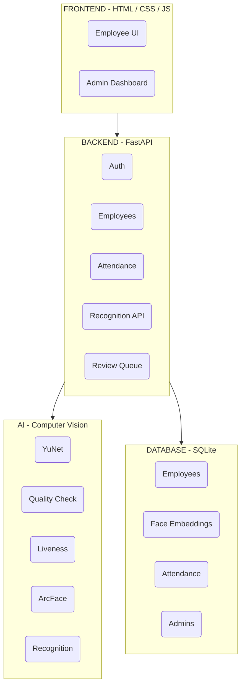

# Architecture

## Overview
FaceAttend AI follows a modular architecture separating Frontend, Backend, and AI components. The root `main.py` is solely responsible for application assembly and startup.

## Conceptual Diagram

## Component Details
- **AI**: Independent from FastAPI, this layer handles all computer vision operations.
- **Backend**: Consumes AI services and manages application state, providing REST endpoints.
- **Database**: Stores the application state, configuration, and biometrics.
- **Frontend**: Communicates with the backend using REST APIs.
